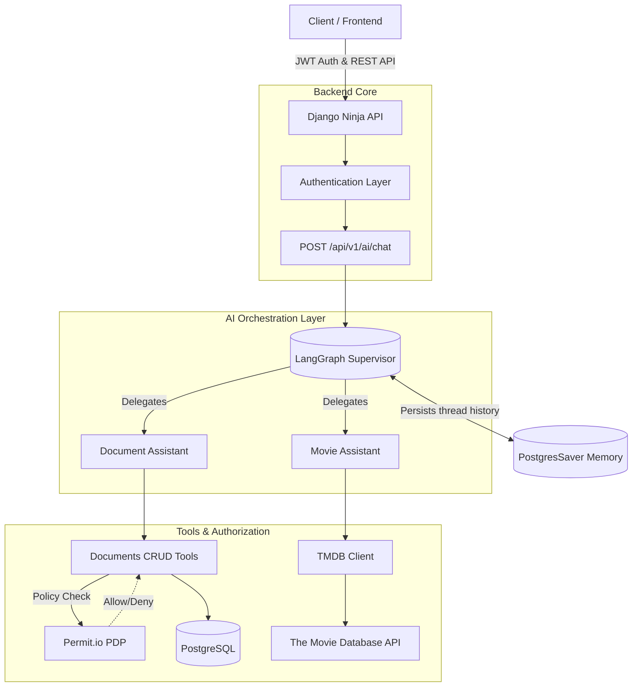

# PolicyAware-LLM-Orchestrator

> **Live Demo:** [Deploying Soon...](#)

A production-ready architecture for building secure, multi-agent AI systems. It integrates **Django** for robust data management, **LangGraph** for advanced agent orchestration, and **Permit.io** for granular Role-Based Access Control (RBAC). 

Unlike typical LLM wrappers, this system ensures that **every AI tool call is policy-checked** before touching the database, completely preventing IDOR and unauthorized AI actions.

## 🏗️ Architecture



## 🚀 Tech Stack

- **Backend:** Python 3.12, Django 5.2, Django Ninja, Django REST SimpleJWT
- **AI/LLM:** LangGraph, LangGraph Supervisor, Google Gemini 2.5 Pro
- **Security:** Permit.io (RBAC Authorization)
- **Database:** PostgreSQL (with LangGraph `PostgresSaver` for conversation memory)
- **Deployment:** Gunicorn, Uvicorn, Docker-ready

## 🛡️ Key Security Features

1. **Policy-in-the-loop AI:** Agents cannot hallucinate permissions. A dynamic `permit.check()` intercepts every ORM call made by LangChain tools.
2. **Thread Isolation:** Chat memory (`thread_id`) is strictly bound to `request.user.pk` to prevent cross-tenant conversation spillage.
3. **Data Protection:** Generic API endpoints enforce IDOR-safe queries (`owner=request.user`) and use soft-deletes (`active=False`).
4. **Internal Error Masking:** Detailed LLM provider errors (like Gemini 429 Rate Limits) are caught and mapped to standard HTTP errors, preventing competitive intelligence leakage.

## 🛠️ Local Setup

1. **Clone the repository:**
   ```bash
   git clone https://github.com/Arpit1033/PolicyAware-LLM-Orchestrator.git
   cd PolicyAware-LLM-Orchestrator
   ```

2. **Create a virtual environment and install dependencies:**
   ```bash
   python -m venv venv
   source venv/bin/activate  # On Windows use: .\venv\Scripts\activate
   pip install -r requirements-lock.txt
   ```

3. **Configure Environment Variables:**
   Create a `.env` file in the `src/` directory modeled after `src/.env.sample`.
   You will need:
   - PostgreSQL credentials
   - `GOOGLE_API_KEY` (from Google AI Studio)
   - `TMDB_API_KEY` (from The Movie Database)
   - `PERMIT_API_KEY` (from Permit.io)

4. **Run Migrations and Start the Server:**
   ```bash
   cd src
   python manage.py migrate
   python manage.py runserver
   ```

## 🌐 API Endpoints

Once running, explore the Swagger documentation at: `http://127.0.0.1:8000/api/v1/docs`

| Method | Endpoint | Description |
|--------|----------|-------------|
| `POST` | `/api/v1/token/pair` | Login and receive JWT access token |
| `GET`  | `/api/v1/health` | System health check |
| `POST` | `/api/v1/ai/chat/` | Send a message to the Multi-Agent Supervisor |
| `GET`  | `/api/v1/documents/list-documents` | List users active documents |
| `POST` | `/api/v1/documents/create-document` | Create a new document |

## 📝 License
This project is licensed under the MIT License.
